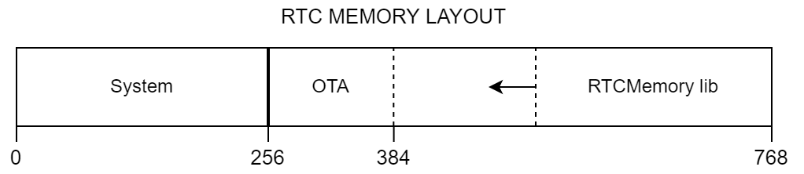

# RTCMemory

 

RTCMemory is a library to ease the access to the RTC memory embedded in ESP8266.

If you are wondering why you should consider an RTC memory or, in general, any low-power memory, you should watch this [video](https://www.youtube.com/watch?v=r-hEOL007nw).

## Motivation

[ESP8266 Arduino core](https://github.com/esp8266/Arduino) provides *byte-oriented* functions to read, write, and check the integrity of data on RTC memory. Hence, accessing data types such as string, integer, or float requires dealing with pointers and casting, leading to hard-to-find errors. So, I created RTCMemory to make this process easier, more intuitive, and error-proof.

## Features

- Simplified access to RTC memory of ESP8266
- Minimum memory footprint (only 4-byte overhead on RTC Memory)
- One-line backup on flash memory
- Compatible with LittleFS and SPIFFS file systems

## Requirements

RTCMemory v2 requires ESP8266 Arduino core >=2.6.0 or, if you are using PlatformIO, platform espressif8266 >=2.3.0 (that includes ESP8266 Arduino core v2.6.1).

## Installation

You can find RTCMemory on Arduino and PlatformIO library registries. You can install it through your favorite IDEs, or you can use the respective command-line tools running:

    arduino-cli lib install RTCMemory

or:

    pio lib install "fabianoriccardi/RTCMemory"

## Usage

You should be aware of very few APIs to effectively use RTCMemory.  
First, define the data structure that will contains your data (max 508 bytes):

    typedef struct {
        int counter;
    } MyData;

Create an instance of `RTCMemory`:

    RTCMemory<MyData> rtcMemory("/path/to/file");

the filepath is an optional parameter, if you don't need the backup on flash memory you can omit it. Then, initialize RTC memory through:

    bool result = rtcMemory.begin();

`result` is true if there are valid data in RTC memory or in flash memory, otherwise is false.

> :memo: **Note:** Remember to initialize the file system before calling begin().

Get the pointer to the buffer containing your data:

    MyData* myData = rtcMemory.getData();

Modify data as you need. Finally, save data on RTC:

    rtcMemory.save();

Remember that RTC memory is a volatile memory, hence data are lost on power failure. To backup your data in flash, call:

    rtcMemory.backup();

## Memory layout

ESP8266 has a total amount of 768 bytes of RTC memory. However, the underlying SDK reserves the first 256 bytes, leaving the remaining 512 bytes to the user application.
Moreover, many ESP8266 firmware use OTA functionality, which requires the first 128 bytes of user memory.
In this condition, to avoid OTA and RTCMemory overlap each other, RTCMemory must limit its size to 384 bytes.
However, if you really need to exceed this threshold, you can alter the soft limiter of the memory size (that is the second parameter (`N`) of the class template), increasing it up to 512 bytes.
The following diagram illustrates the global RTC memory layout.

Note that the RTCMemory data are always *shifted* toward the highest addresses of the RTC memory, so that the reserved memory expands toward the lower addresses.

## About the file system

ESP8266 Arduino provides 2 file systems: SPIFFS and LittleFS. However, since April 2020, only LittleFS is officially supported while SPIFFS is deprecated. For this reason, LittleFS becomes the default one since RTCMemory v2. However, you can still use SPIFFS (or any other file system) by specifying it in RTCMemory constructor.
